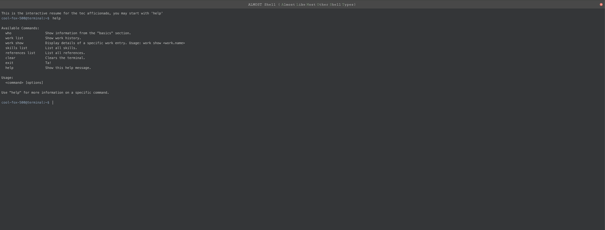

# \<jsonresume-terminal>

This webcomponent follows the [open-wc](https://github.com/open-wc/open-wc) recommendation.


[](https://jsonresume.org/)

## Installation

```bash
npm i jsonresume-terminal
```

## Usage

```html
<script type="module">
  import 'jsonresume-terminal/jsonresume-terminal.js';
</script>

<jsonresume-terminal></jsonresume-terminal>
```


## Tooling configs

For most of the tools, the configuration is in the `package.json` to minimize the amount of files in your project.

If you customize the configuration a lot, you can consider moving them to individual files.

## Local Demo with `web-dev-server`

```bash
npm start
```

To run a local development server that serves the basic demo located in `demo/index.html`


## Resume Data
You can pass a `github-username` attribute to the component to fetch the resume data from github.
For that you must have a public gist with the name `resume.json` in your github account.

In that json you must have a valid jsonresume.
